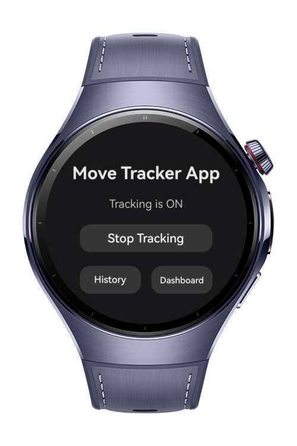
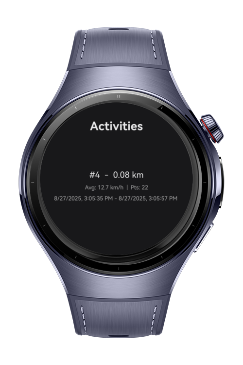
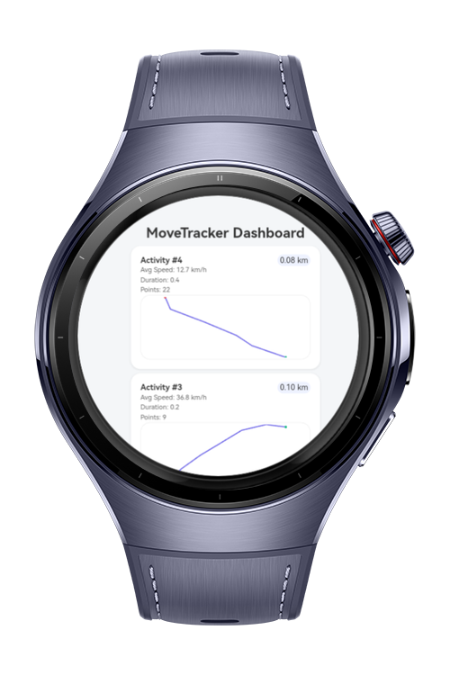

# Move Tracker App

MoveTracker is an activity tracking application.It records walking, running or cycling sessions, draws the route and shows summary statistics.
# Preview

<div>
  
  
  
</div>

# Use Cases

- Real-time location tracking
- Background task for continuous tracking when the app is minimized
- Route drawing (start = green, end = red, path = blue)
- Activity statistics: distance, average speed, points count
- History of past activities
- Dashboard with ArkWeb

# Tech Stack

- **Languages**: ArkTS, ArkUI
- **Frameworks**: HarmonyOS 6.0.0 Beta3
- **Tools**: DevEco Studio 6.0.0.828
- **Libraries**:
    - `@kit.ArkUI`
    - `@kit.AbilityKit`
    - `@kit.BasicServicesKit`
    - `@kit.PerformanceAnalysisKit`
    - `@kit.NotificationKit`
    - `@kit.LocationKit`
    - `@ohos.web.webview`
    - `@ohos.resourceschedule.backgroundTaskManager`

# Directory Structure

```
entry/
├── src/main/
│ ├── resources/rawfile/
│ │ ├── style.css
│ │ └── script.js
│ │ └── dashboard.html
├── src/main/ets/
│ ├── services/
│ │ ├── LocationService.ets
│ │ └── BackgroundTaskService.ets
│ │
│ ├── entryability/
│ │ └── EntryAbility.ets
│ │
│ ├── entrybackupability/
│ │ └── EntryBackupAbility.ets
│ │
│ ├── data/
│ │ ├── ActivityStore.ets
│ │
│ ├── pages/
│ │ ├── DashboardPage.ets
│ │ ├── HistoryPage.ets
│ │ ├── MainPage.ets
│ │
```

# Constraints and Restrictions
## Supported Device

* Huawei Watch 5

# License

**MoveTracker** is distributed under the terms of the MIT License

See the [LICENSE](./LICENSE) for more information.
